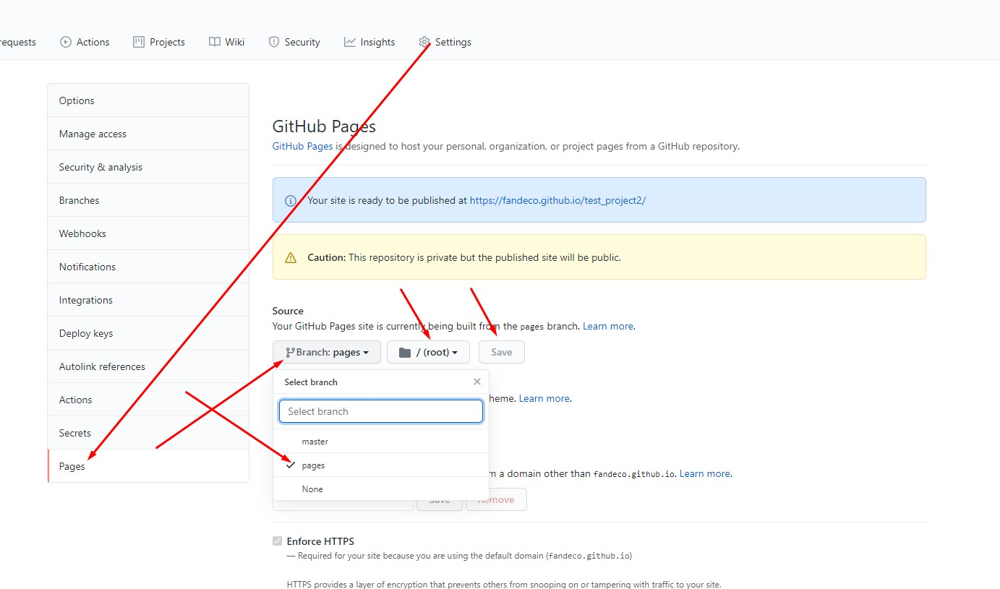

## Проект для верстащика

Подключенные шаблоны

- Bootstrap 5
- Jquery 3.5.0
- Fancybox 3.5.7
- JamesIves/github-pages-deploy-action@4.1.4 - автоматическая сборка страницы после публикации в github

## Установка зависимостей

```bash
npm install
```

## Запуск
Запуск локального сервера

```bash
gulp
```


## Сборка файлов
Соберет html файлы

```bash
gulp build
```

## Сайт с проектом

Чтобы получить ссылку в виде с версткой 

https://fandeco.github.io/PROJECT_NAME/

После первого commit будет автоматически создана ветка pages
Для включения сайт нужно зайти в настройки и выполнить действия на скриншоте
​


### generate filter 
https://codepen.io/sosuke/pen/Pjoqqp
